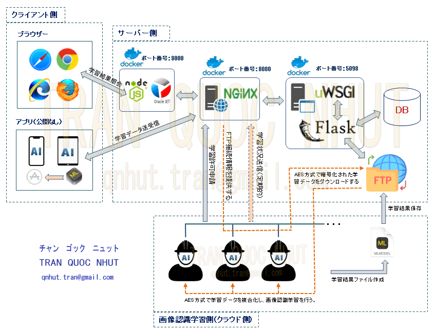
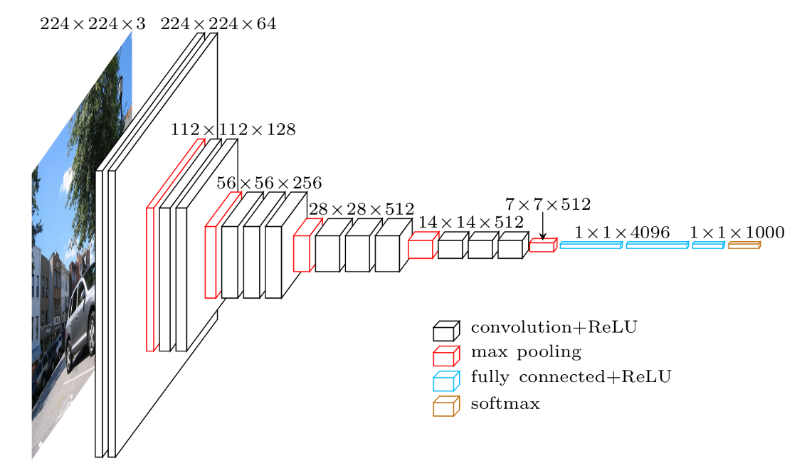

# フロー図

# フォルダー構築
> KerasNodeJs 
>　|_ KerasServer（サーバー側） 
>　|　　　|_ bridge（公開なし） 
>　|　　　|_ nginx（公開なし） 
>　|　　　|_ nodejs（サーバーサイド） 
>　|　　　|_ uwsgi（APIサービス） 
>　|_ KerasClient（画像認識学習側） 
>　|　　　|_ traindata（公開なし） 
>　|　　　|_ trainapp（AIワーカー） 
>　|_ KerasApp（スマホアプリ-公開なし） 
>
> ※docker-compose.yml、Dockerfileなども公開なし

# 説明
### ① サーバー側
※Nginx + uWSGI + FlaskでAPIサービスを動かす。
- nginx: Nginxを通じてHTTPクライアントからのリクエストをuWSGIに転送する。
- uwsgi: APIサービス（uWSGI + Flask）として下記を処理させて、クライアント側へ結果を返却する。
    - ログインAPI、ログアウトAPI
    - 学習状況監視、画像データ閲覧などのデータ抽出API
    - データ更新API
    - データ登録API
    - データ削除API
    - 学習データアップロードAPI
    - 学習データダウンロードAPI
- bridge: H5, MLModel等の学習ファイルを管理する。
- 環境構築：Docker, Nginx, uWSGI, Flask
- 開発言語：Python 3.8

### ③ 画像認識学習側（クラウド側）
- traindata: 学習データおよび学習結果データを保存するフォルダーである。 
学習データについてはAES方式で暗号化されたpickle拡張子のファイルである。
- trainapp: 画像データ学習アプリケーションで、AIワーカーとして定期的に動かすようにする。 
    - 複数のAIワーカーが同時に学習できるが、同時学習可能なAIワーカーを超える場合は、 
    メモリがオーバーされる可能性があるため、スキップとする。 
    - 画像データ学習終了後、学習結果(H5, MLModelなど)をサーバー側（FTPサーバー）へ再送し、 クライアント側で学習データを全て削除する。
- 環境構築: Docker, Redis, Celery
- 開発言語: Python 3.8
- ディープラーニング方法: Keras (VGG16モデル, VGG19モデルなど)
- モデルイメージ 
    

### ② クライアント側
- ブラウザー 
    - nodejs: Node.js上のフレームワークを用いてOracle JET Webアプリケーションである。 
        - ログインできた場合は暗号化済みクッキー情報をクライアント側へ返却する。 
        - サーバー側ではNginxを通じて自動でログイン状況が認証されるため、 
        クライアント側のクッキー情報が無断で編集された場合は、自動でログイン画面へ遷移される。
    - 環境構築: Docker, Node.js
    - 開発言語: Oracle JET, Knockout, Linq
- スマホアプリ（公開なし） 
    - AIワーカーが学習したデータにより、本人認識を行い、活動状況を記録するアプリである。
    - 本人の活動履歴はブラウザー・スマホアプリの両方から閲覧できる。
    - 開発言語: Swift, Object-C
    - 物体検知技術: OpenCV DNNを採用する。
